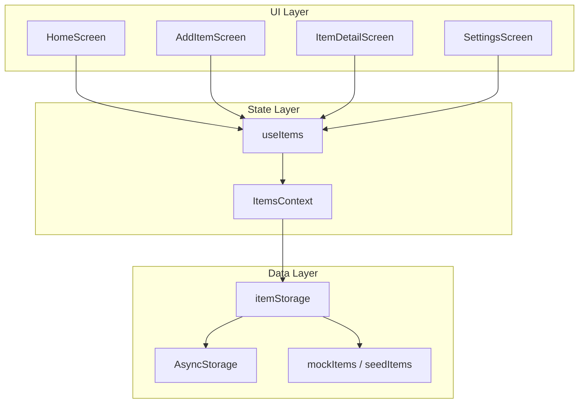

# 宿舍物证库 — 架构说明

## 产品架构



## 目录地图

```text
App.tsx                 # 入口：Provider + Navigation
index.js                # gesture-handler 首行导入
src/
  navigation/           # RootNavigator
  screens/              # 4 个页面
  components/           # ItemCard, TagChips, EmptyState...
  context/              # ItemsContext 全局状态
  storage/              # AsyncStorage 封装
  utils/                # filterItems 等纯函数
  types/                # Item, RootStackParamList
  constants/            # theme, labels, PRESET_TAGS
  data/                 # mockItems, seedItems
docs/
  phases/               # 分阶段学习文档
  DEMO.md               # 答辩脚本
  ARCHITECTURE.md       # 本文件
```

## Item 数据模型

```typescript
type Item = {
  id: string;
  name: string;
  location: string;
  note: string;
  imageUri: string;
  tags: string[];
  isPinned: boolean;
  createdAt: string; // ISO 8601
};
```

## 导航路由

| 路由名 | 参数 | 说明 |
|--------|------|------|
| Home | 无 | 首页列表 |
| AddItem | `{ itemId? }` | 添加或编辑 |
| ItemDetail | `{ itemId }` | 详情 |
| Settings | 无 | 演示数据 / 清空 |

## 8 亮点与代码位置

| 亮点 | 主要文件 |
|------|----------|
| L1 建档 | `AddItemScreen.tsx`, `ItemsContext.addItem` |
| L2 标签筛选 | `HomeScreen.tsx`, `itemFilters.ts`, `TagChips.tsx` |
| L3 搜索 | `HomeScreen.tsx`, `filterItems` |
| L4 详情 | `ItemDetailScreen.tsx` |
| L5 持久化 | `itemStorage.ts`, `ItemsContext` |
| L6 置顶/最近 | `ItemDetailScreen.togglePin`, `itemFilters.ts`, `HomeScreen` |
| L7 空状态 | `EmptyState.tsx`, `HomeScreen` |
| L8 编辑删除 | `AddItemScreen` 编辑模式, `ItemDetailScreen` Alert |

## 依赖清单

| 包 | 用途 |
|----|------|
| @react-navigation/native | 导航核心 |
| @react-navigation/native-stack | 原生栈 |
| react-native-screens | 原生 Screen 容器 |
| react-native-gesture-handler | 手势（导航依赖） |
| react-native-safe-area-context | 安全区 |
| react-native-image-picker | 相机/相册 |
| @react-native-async-storage/async-storage | 本地 KV 存储 |

## 扩展方向（未实现）

- 图片复制到 `DocumentDirectory` 防 URI 失效
- 导出 JSON 备份
- 深色模式跟随系统
