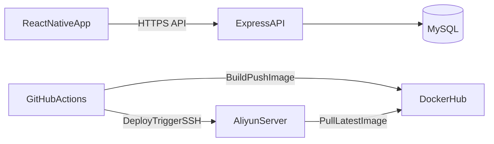
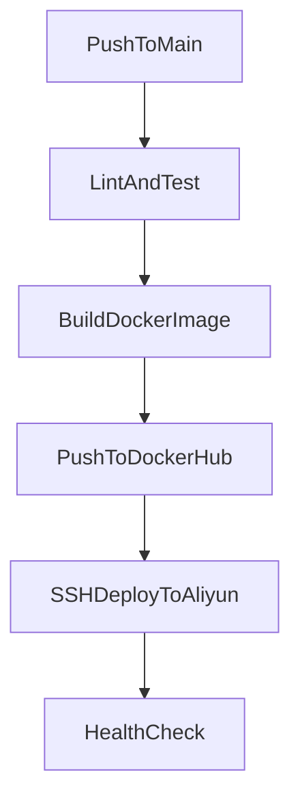

# 物证库后续规划（前后端互通 + Docker Hub + CI/CD）

> 本文档仅作为后续实施路线，不会改变当前项目行为，不包含任何可执行脚本。

## 1. 目标与边界

### 目标

- 在现有 React Native 项目基础上，升级为前后端互通版本
- 后端技术栈固定为：Node.js + Express + MySQL
- 容器化与发布链路固定为：Docker + Docker Hub + GitHub Actions + 阿里云服务器
- 形成可用于简历的“开发-测试-部署-演示”完整闭环

### 非目标（当前阶段不做）

- 不更换后端框架（如 NestJS、Koa）
- 不做复杂微服务拆分
- 不做商店上架流程（Google Play / App Store）
- 不做高复杂度多租户权限系统

---

## 2. 总体架构（目标态）



---

## 3. 里程碑计划（建议执行顺序）

## M1：后端最小闭环（本地）

### 交付物

- `backend/` 独立服务目录
- Express API 跑通（本地）
- MySQL 表结构初始化脚本
- 基础接口可联调

### 最小接口

- `POST /auth/register`
- `POST /auth/login`
- `GET /items`
- `POST /items`
- `PATCH /items/:id`
- `DELETE /items/:id`
- `GET /health`

### 验收标准

- Postman 可完成注册、登录、增删改查
- 数据正确落库到 MySQL
- 未登录请求 items 接口返回 401

---

## M2：RN 接入后端（保留可回退能力）

### 交付物

- RN 端新增 API 层与认证状态管理
- `Items` 数据来源改为“远端优先 + 本地兜底”
- 登录后展示个人数据

### 关键要求

- 不破坏当前本地版能力
- 接口异常时有可视化提示
- token 过期后可引导重新登录

### 验收标准

- RN 可登录并拉取后端 items
- RN 新增/编辑/删除可同步到后端
- 断网时不会直接崩溃（可提示离线）

---

## M3：Docker 化（本地容器运行）

### 交付物

- `backend/Dockerfile`
- `docker-compose.yml`（至少包含 api + mysql）
- `.env.example`（不含真实密钥）

### 验收标准

- 一条命令拉起容器
- API 容器能连接 MySQL 容器
- `GET /health` 返回 200

---

## M4：Docker Hub 发布链路

### 交付物

- 后端镜像可推送 Docker Hub
- tag 策略明确（`latest` + `sha`）

### 验收标准

- Docker Hub 可看到镜像与 tag
- 服务器可手动 `docker pull` 成功

---

## M5：GitHub Actions 自动化部署

### 交付物

- `.github/workflows/backend-cicd.yml`
- CI：lint + test
- CD：build/push image + SSH 部署

### 验收标准

- push 到主分支后，流水线全绿
- 阿里云服务器容器自动更新
- 服务可公网访问，RN 可正常请求

---

## 4. 目录建议（目标态）

```text
personalProject/
  mobile/                      # 可选：后续若拆分，当前 RN 可保持根目录
  backend/
    src/
      routes/
      controllers/
      services/
      middlewares/
      db/
    Dockerfile
    package.json
    .env.example
  docs/
    FULLSTACK_CICD_PLAN.md
    BACKEND_API_SPEC.md        # 后续补充
    DEPLOY_RUNBOOK.md          # 后续补充
  .github/
    workflows/
      backend-cicd.yml
```

> 注：是否拆分 `mobile/` 可后续决定；若不拆分，保持 RN 在根目录也可行。

---

## 5. 数据模型草案（MySQL）

## users

- `id` bigint pk auto_increment
- `email` varchar(128) unique not null
- `password_hash` varchar(255) not null
- `created_at` datetime not null

## items

- `id` bigint pk auto_increment
- `user_id` bigint not null (fk users.id)
- `name` varchar(100) not null
- `location` varchar(150) not null
- `note` text null
- `image_url` varchar(500) null
- `tags_json` json not null
- `is_pinned` tinyint(1) not null default 0
- `created_at` datetime not null
- `updated_at` datetime not null

---

## 6. 环境变量规范（草案）

## backend

- `PORT=3000`
- `NODE_ENV=production`
- `JWT_SECRET=...`
- `MYSQL_HOST=...`
- `MYSQL_PORT=3306`
- `MYSQL_USER=...`
- `MYSQL_PASSWORD=...`
- `MYSQL_DATABASE=...`
- `CORS_ORIGIN=...`

## github secrets（后续配置）

- `DOCKERHUB_USERNAME`
- `DOCKERHUB_TOKEN`
- `SERVER_HOST`
- `SERVER_USER`
- `SERVER_SSH_KEY`
- `SERVER_PORT`
- `SERVER_APP_DIR`

---

## 7. CI/CD 流程草案



### 部署动作（逻辑）

1. 登录 Docker Hub
2. 拉取最新镜像
3. 停止旧容器
4. 启动新容器（注入生产环境变量）
5. 执行健康检查

---

## 8. 风险与规避

- 密钥泄露风险：严禁将 `.env` 与私钥提交到仓库
- 数据丢失风险：MySQL 必须挂载数据卷并做备份
- 回滚风险：保留 `sha` tag，部署失败可快速回滚
- 接口变更风险：先维护 API 文档，再改 RN 调用层

---

## 9. 简历可复用表述（草案）

- 负责 React Native 移动端与 Express + MySQL 后端联调，完成登录鉴权与物品数据同步
- 基于 Docker 完成后端容器化，使用 Docker Hub 进行镜像版本管理（latest + commit sha）
- 通过 GitHub Actions 实现 CI/CD（自动测试、自动构建、自动部署至阿里云）
- 构建可公网访问 API，并支持移动端真实设备演示

---

## 10. 后续执行约定

- 每次新增功能时优先保证“可扩展，不写死”
- 优先新增而不是重构（避免大改）
- 每完成一个里程碑，补对应文档与验收记录

