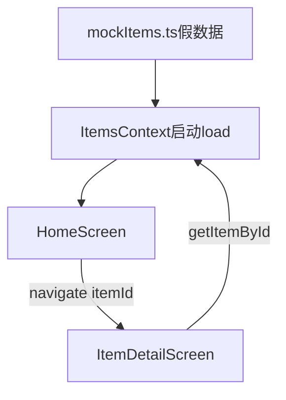

# 阶段 A：导航与列表

## 本阶段做了什么

- 搭建 `src/` 目录结构与 TypeScript 类型（`Item`、路由参数）
- 接入 **React Navigation** 原生栈，共 4 个页面：首页、添加、详情、演示设置
- 首页用 **假数据**（`mockItems.ts`）展示物品卡片列表
- 分区 UI：**置顶**、**最近添加**、**全部物品**（数据来自 mock 字段，完整交互在阶段 D）
- **空状态**骨架：无数据时显示引导文案与「添加第一件物品」按钮（亮点 L7 骨架）
- 统一主题色与 SafeArea 适配

**本阶段尚未实现**：相机、真实保存、搜索、标签筛选、编辑删除（已在后续阶段代码中预留入口）。

---

## 核心文件与职责

| 文件 | 职责 |
|------|------|
| `App.tsx` | 根组件：`SafeAreaProvider` + `NavigationContainer` + `ItemsProvider` |
| `index.js` | 首行导入 `react-native-gesture-handler`（导航必需） |
| `src/navigation/RootNavigator.tsx` | 定义 4 个 Screen 与标题栏样式 |
| `src/screens/HomeScreen.tsx` | 首页列表、分区、FAB、空状态 |
| `src/screens/AddItemScreen.tsx` | 添加/编辑表单（阶段 A 可进入，完整功能见阶段 B） |
| `src/screens/ItemDetailScreen.tsx` | 详情展示（阶段 A 可点 mock 进入） |
| `src/types/item.ts` | `Item` 类型与 `RootStackParamList` |
| `src/data/mockItems.ts` | 假数据；改为 `[]` 可测空状态 |
| `src/constants/theme.ts` | 颜色、间距、圆角 |
| `src/components/ItemCard.tsx` | 列表卡片 UI |
| `src/components/EmptyState.tsx` | 空状态 UI |

---

## RN 知识点

### 1. 组件与 JSX

- Screen 都是函数组件，返回 `<View>` / `<Text>` / `<FlatList>` 等
- 样式用 `StyleSheet.create({...})` 写在文件底部，避免每次 render 新建对象

### 2. React Navigation

- **NavigationContainer**：包住整个 App 的路由上下文
- **Native Stack**：页面像卡片一样 push/pop，自带标题栏
- **跳转**：`navigation.navigate('ItemDetail', { itemId: 'xxx' })`
- **取参**：`route.params.itemId`（在详情页）

### 3. FlatList

- 长列表用 `FlatList` 而不是 `map` 包在 `ScrollView` 里（性能更好）
- `keyExtractor` 必须唯一；本阶段用 `header` / `item` 两种 row 类型

### 4. Safe Area

- 刘海屏/状态栏区域用 `useSafeAreaInsets()` 取 padding，避免内容被挡住

---

## 数据流图



阶段 A 首次启动：若 AsyncStorage 无数据，会 fallback 到 `MOCK_ITEMS`（与纯假数据效果一致）。

---

## 自测步骤（复制执行）

```bash
cd d:\RNobject\personalProject
npm install
npm start
# 新终端
npm run android
```

验收清单：

1. 启动后首页显示至少 3 条物品（充电器、校园卡等）
2. 点击任意卡片 → 进入详情，见名称、位置、标签、大图
3. 点击右下角 `+` 或空状态按钮 → 进入「添加物证」页
4. 首页右上角「演示」→ 进入演示与数据页
5. **测空状态**：把 `src/data/mockItems.ts` 里 `MOCK_ITEMS` 改成 `[]`，重装或清数据后应看到空状态引导

```bash
npm run lint
npm test
```

---

## 答辩小问题（5 题 + 参考答案）

**Q1：为什么用 React Navigation 而不是自己写 if/else 切页面？**  
A：导航库统一管理页面栈、返回手势、标题栏和传参，代码可维护；自己写很快会变成一团 switch。

**Q2：FlatList 和 ScrollView + map 有什么区别？**  
A：FlatList 只渲染屏幕可见项（虚拟列表），物品多了更省内存；ScrollView 会一次渲染全部子节点。

**Q3：route.params 是什么？**  
A：跳转时带的参数对象，例如 `{ itemId: 'mock-1' }`，下一屏用 `route.params.itemId` 读取。

**Q4：空状态为什么要单独做？**  
A：无数据时不能留白，要告诉用户「下一步做什么」——这是产品体验，也是答辩亮点 L7。

**Q5：Item 类型为什么集中在一个文件？**  
A：全局数据形状一致，改字段时 TypeScript 会提示所有用到的地方，减少 bug。

---

## 下一阶段预告（阶段 B）

- 接入 `react-native-image-picker`：拍照 / 相册
- 添加页提交后写入内存并刷新列表
- 详情页展示真实大图与备注  
- **达成亮点 L1（建档）、L4（详情大图+备注）**

确认阶段 A 无误后，回复「确认进入阶段 B」继续。
