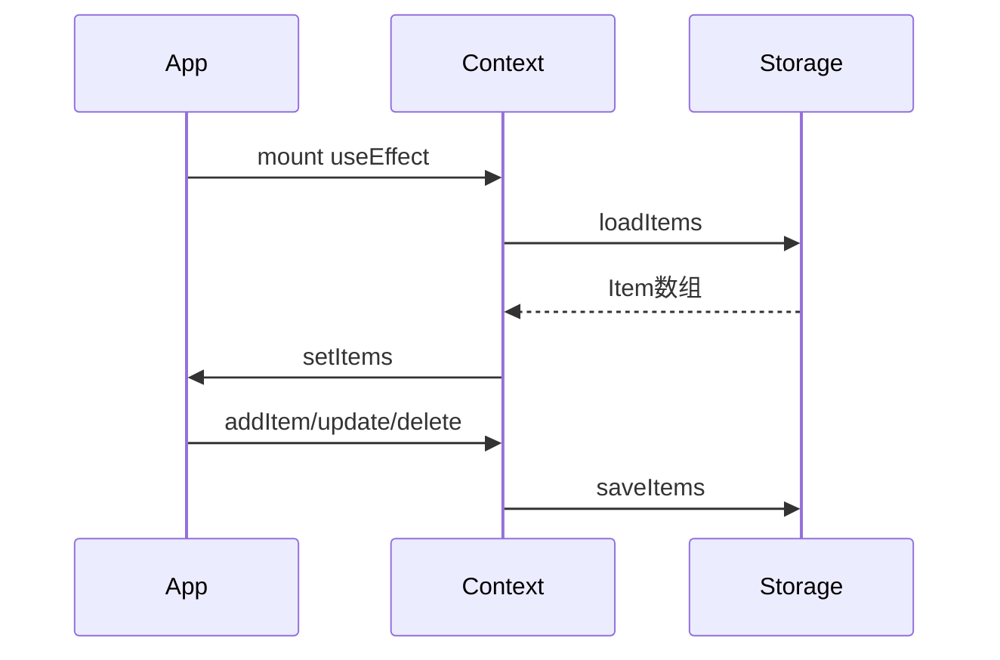

# 阶段 C：持久化 + 搜索 + 标签筛选

## 本阶段做了什么

- **AsyncStorage** 封装：`loadItems` / `saveItems`（`src/storage/itemStorage.ts`）
- App 启动时加载本地数据；无数据时使用 `MOCK_ITEMS` 默认值
- 每次增删改后自动 **persist**
- 首页 **搜索框**：匹配名称、位置、备注、标签（不区分大小写）
- 横向 **标签 Chip 筛选**：点选过滤，再点或点「全部」取消
- 筛选模式下展示扁平列表；无匹配时提示「没有匹配的物品」

**达成亮点**：**L2** 多标签分类 · **L3** 关键词搜索 · **L5** 本地持久化

---

## 核心文件

| 文件 | 职责 |
|------|------|
| `src/storage/itemStorage.ts` | AsyncStorage 读写 |
| `src/context/ItemsContext.tsx` | 启动 load、变更后 save |
| `src/utils/itemFilters.ts` | `filterItems`、`getAllTags` |
| `src/screens/HomeScreen.tsx` | 搜索 state、TagChips 筛选 |

---

## 数据流

---

## 自测步骤

1. 新建一条 → 完全关闭 App（杀进程）→ 再开，数据仍在 → **L5**
2. 搜索「充电」→ 只显示相关项 → **L3**
3. 点标签「证件」→ 只显示带该标签的项 → **L2**
4. 搜索无结果 → 显示「没有匹配的物品」

---

## 答辩小问题

**Q1：AsyncStorage 和 SQLite 怎么选？**  
A：几十条 JSON 用 AsyncStorage 足够简单；上千条再考虑 SQLite。

**Q2：filterItems 为什么用 useMemo？**  
A：搜索词或标签变化时才重算，避免每次 render 都过滤整个数组。

**Q3：为什么首次没数据还要 MOCK？**  
A：方便开发演示；答辩时可清空后现场新建，或导入 seed 数据。

---

## 下一阶段预告（阶段 D）

编辑、删除确认、置顶切换、完整空状态引导 → **L6 L7 L8**
