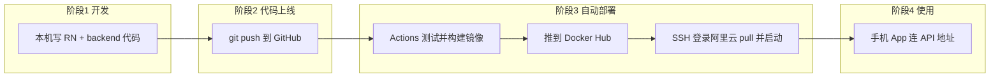

# 宿舍物证库 — 全栈部署总览（从零到上线）

> 给你自己看的「地图」，不是跟着抄命令。先懂**在干什么**，再执行**哪一步**。

---

## 一、你到底在做什么？（一句话）

你要做三件事，连成一条线：

1. **手机 App（RN）** — 用户拍照、记物品  
2. **后端 API（Express + MySQL）** — 登录、存数据、存图片，跑在**阿里云**  
3. **自动部署（GitHub Actions）** — 你本机 `git push` 后，自动构建 Docker 镜像并更新服务器  

**不是**把 App 上架应用商店，而是：**代码在 GitHub → 服务器能公网访问 API → 手机能连这个 API**（简历/答辩够用）。

---

## 二、三个「地方」，别混了

```text
┌─────────────────┐     git push      ┌─────────────────┐
│  你的 Windows    │ ───────────────► │     GitHub       │
│  D:\RNobject\   │                   │  存代码 + Secrets │
│  personalProject │                   │  + Actions 流水线│
└────────┬────────┘                   └────────┬────────┘
         │                                      │
         │ npm start / 模拟器                    │ 自动：构建镜像
         │ 开发调试 App                          │ 推 Docker Hub
         │                                      │ SSH 更新服务器
         ▼                                      ▼
┌─────────────────┐     HTTP API      ┌─────────────────┐
│  Android 模拟器  │ ◄─────────────── │  阿里云 47.114.. │
│  或真机          │   :3000          │  Docker 跑 API   │
└─────────────────┘                   └─────────────────┘
```

| 地方 | 干什么 | 用什么窗口 |
|------|--------|------------|
| **本机 Windows** | 写代码、跑 RN、`git push` | 项目目录 cmd / PowerShell |
| **GitHub 网站** | 存代码、配 Secrets、看 Actions 绿没绿 | 浏览器 |
| **阿里云服务器** | 跑 Docker（API + MySQL） | SSH 黑窗口（`root@47.114...`） |

**易混点：**

- 本机 `docker` 要开 **Docker Desktop**；服务器上的 `docker` **不用**你电脑 Desktop。  
- `todolist_deploy` 私钥 = 让 **GitHub Actions 登录阿里云**；不是 GitHub 拉代码用的。  
- 服务器 `git clone` 要的是 **仓库里有代码**；你现在是 **空仓库**，所以要先本机 **push**。

---

## 三、整条链路（按时间顺序）



| 阶段 | 目标 | 你怎么知道完成了 |
|------|------|------------------|
| 1 开发 | 功能写好 | 本机 Metro + 模拟器能打开 App |
| 2 代码上 GitHub | 远程不再是空仓库 | GitHub 网页能看到 `backend/`、`src/` 等文件 |
| 3 自动部署 | 服务器跑起 API | Actions 全绿；`http://47.114.113.35:3000/health` 返回 ok |
| 4 手机联调 | 登录、同步数据 | App 设置里 API 指向服务器，能注册登录 |

---

## 四、你已经做完的（打勾）

根据目前进度，**已完成**：

- [x] RN 本地 App（物证库功能）  
- [x] 项目里已有 `backend/`、`docker-compose`、`GitHub Actions 配置`  
- [x] GitHub 仓库已创建：`panxinyang-one/MyObject-RN`  
- [x] GitHub **7 个 Secrets** 已配置（Docker、服务器 SSH 等）  
- [x] 阿里云能 SSH 登录（`root`，密钥 `todolist_deploy`）  
- [x] 服务器已装 Docker / Compose，`hello-world` 成功  
- [x] 服务器已建目录 `/opt/myobject-rn`，HTTPS clone 过（但是**空仓库**）  

**还没做（明天的核心）：**

- [ ] **本机把代码 push 到 GitHub**（最重要，空仓库问题在这）  
- [ ] 服务器 `git pull` 拿到代码  
- [ ] 服务器配置 `deploy/.env.prod`（密码、JWT，只放服务器）  
- [ ] 首次启动容器或等 Actions 部署  
- [ ] 安全组放行 **3000**  
- [ ] 浏览器测 `http://47.114.113.35:3000/health`  
- [ ] App 里改 API 地址、登录测试  

---

## 五、每个名词是干什么的（懵的时候看这里）

| 名词 | 是什么 | 类比 |
|------|--------|------|
| **Git / GitHub** | 代码网盘 + 版本记录 | 百度网盘，push = 上传 |
| **git push** | 本机代码上传到 GitHub | 交作业 |
| **GitHub Secrets** | 给机器人用的密码抽屉 | Actions 用的钥匙，不能写进代码 |
| **GitHub Actions** | 云端自动跑脚本 | push 后自动测试、打包、部署 |
| **Docker** | 把程序打成盒子运行 | 盒子在哪都能同样跑起来 |
| **Docker Hub** | 存盒子的仓库 | `pxy0921/myobject-rn-docker` |
| **docker compose** | 一次启动多个盒子（API + MySQL） | 一键开机 |
| **阿里云 ECS** | 一台 Linux 云电脑 | 你的服务器 `47.114.113.35` |
| **SSH / 私钥** | 远程登录服务器的钥匙 | `todolist_deploy` 给 Actions 登录用 |
| **API / :3000** | 手机访问后端的网址 | `http://47.114.113.35:3000` |
| **PUBLIC_BASE_URL** | 服务器认为自己的对外地址 | 要和手机能访问的地址一致 |
| **.env.prod** | 服务器上的配置文件（密码等） | 只放服务器，不提交 Git |

---

## 六、明天按这个顺序做（共 6 步）

### 第 0 步：打开三个东西（心里要有数）

1. 本机：**一个 cmd** → `D:\RNobject\personalProject`  
2. 浏览器：**GitHub 仓库** + **Actions 页**  
3. 服务器：**SSH 黑窗口**（`ssh -i ... todolist_deploy root@47.114.113.35`）

---

### 第 1 步：本机 push 代码（解决「空仓库」）

**在哪：** 本机 cmd，项目目录  

**干什么：** 让 GitHub 上有完整项目  

```powershell
cd D:\RNobject\personalProject
git status
```

- 若没有 git： `git init` → `git branch -M main`  
- 添加远程： `git remote add origin git@github.com:panxinyang-one/MyObject-RN.git`  
  （已有 origin 用 `git remote set-url origin ...`）  

```powershell
git add .
git commit -m "feat: fullstack app with backend and CI/CD"
git push -u origin main
```

**完成标志：** 打开 https://github.com/panxinyang-one/MyObject-RN 能看到 `backend`、`src`、`App.tsx` 等，不再是 Empty。

**若 push 失败：** 把完整报错复制保存；常见是 SSH 没配 GitHub，改用 HTTPS + Token。

---

### 第 2 步：看 GitHub Actions（自动部署）

**在哪：** 浏览器 → 仓库 → **Actions**  

**干什么：** 等 `Backend CI/CD` 跑完（黄 → 绿）  

**完成标志：** 最新一次 workflow **全绿**  

**若红了：** 点进去看哪一步红（test / build / deploy），把日志最后 20 行记下来。

**注意：** deploy 步要求服务器上已有 `/opt/myobject-rn` 且存在 `deploy/.env.prod`（第 3 步）。若第一次 deploy 红，做完第 3 步可在 Actions 里 **Re-run**。

---

### 第 3 步：服务器拉代码 + 配环境

**在哪：** 阿里云 SSH 黑窗口  

```bash
cd /opt/myobject-rn
git pull origin main
ls
```

应能看到 `backend` `deploy` `src` 等。

```bash
cp deploy/env.prod.example deploy/.env.prod
nano deploy/.env.prod
```

**必须改这几项（自己生成，不要弱密码）：**

- `JWT_SECRET`  
- `MYSQL_ROOT_PASSWORD`  
- `MYSQL_PASSWORD`  
- 确认 `PUBLIC_BASE_URL=http://47.114.113.35:3000`  
- 确认 `DOCKER_IMAGE=pxy0921/myobject-rn-docker:latest`  

保存：`Ctrl+O` 回车，`Ctrl+X` 退出。

**完成标志：** `deploy/.env.prod` 存在且密码已填。

---

### 第 4 步：阿里云安全组 + 启动服务

**在哪：** 阿里云控制台（浏览器）+ SSH  

1. ECS → 安全组 → **入方向** 放行 **TCP 3000**（和 22）  

**若 Actions 已绿**，服务器上可检查：

```bash
cd /opt/myobject-rn
docker compose -f deploy/docker-compose.prod.yml --env-file deploy/.env.prod ps
curl http://127.0.0.1:3000/health
```

**若 Actions 还没绿或镜像还没有**，可手动启动一次：

```bash
cd /opt/myobject-rn
docker compose -f deploy/docker-compose.prod.yml --env-file deploy/.env.prod up -d
```

**完成标志：**

- 服务器上：`curl` 返回 `"status":"ok"`  
- 你电脑浏览器：http://47.114.113.35:3000/health 也能打开  

---

### 第 5 步：手机 App 连后端

**在哪：** 本机 Metro + 模拟器  

1. `npm run start:reset`  
2. `adb reverse tcp:8081 tcp:8081`  
3. `adb reverse tcp:3000 tcp:3000`（模拟器连本机 Docker 时）  

**连阿里云（真机或模拟器访问公网）：**

- App → **设置** → API 地址：`http://47.114.113.35:3000`  
- **登录 / 注册** → 添加物证 → 看是否同步  

**完成标志：** 登录成功，新增物证后，换设备登录仍能看到（云端）。

---

### 第 6 步：以后日常怎么更新

```text
本机改代码 → git commit → git push
                ↓
         Actions 自动部署
                ↓
         手机继续用同一 API 地址
```

你**不需要**每次手动 SSH 部署；Secrets 配好后，push 即可。

---

## 七、出问题去哪查

| 现象 | 可能原因 | 查哪里 |
|------|----------|--------|
| 空仓库 / clone empty | 没 push | 先做第 1 步 |
| push Permission denied | 本机 GitHub SSH | 换 HTTPS + Token |
| Actions deploy 红 | `.env.prod` 没有或 SSH Secret 错 | Actions 日志 + 服务器 `ls /opt/myobject-rn` |
| health 打不开 | 安全组没开 3000 或容器没起 | `docker ps`、阿里云安全组 |
| App 连不上 | API 地址错 | 模拟器 10.0.2.2 vs 真机 47.114.113.35 |
| 本机 docker 报错 Desktop | 没开 Docker Desktop | 只影响本机测试，不影响阿里云 |

更细命令见：[SECRETS_CHECKLIST.md](./SECRETS_CHECKLIST.md)、[DEPLOY_RUNBOOK.md](./DEPLOY_RUNBOOK.md)、[BACKEND_API_SPEC.md](./BACKEND_API_SPEC.md)

---

## 八、你现在的位置（一张表）

```text
[完成] 写代码、配 Secrets、服务器 Docker
   ↓
[你在这里] ← 本机 git push（GitHub 还是空的）
   ↓
[明天] Actions 部署 → .env.prod → 安全组 → 手机联调
   ↓
[完成] 全栈闭环
```

---

## 九、明天只需记住一句话

**先把本机项目 push 到 GitHub，让仓库不再是空的；其余都围着这件事展开。**

祝你明天顺利。卡住时带着：**做到第几步 + 完整报错** 回来即可。
